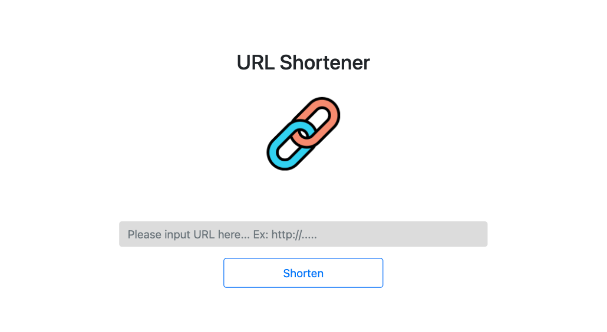

## URL Shortener 短網址產生器 

### 功能介紹
- 若網址較長，可透過此網頁將原始網址縮短為短網址。
- 在伺服器啟動期間，使用者可以在瀏覽器的網址列，輸入短網址，瀏覽器就會導向原本的網站。

### 專案畫面

- 首頁


- 產生短網址頁面


### 安裝

1. 透過終端機(Terminal)，先將此專案存放至本地位置

2. 在本地開啟之後，透過終端機進入資料夾，輸入：

   ```bash
   npm install // 安裝套件
   ```

3. 安裝完畢後，設定 MongoDB 環境變數：

   ```bash
   set MONGODB_URI="你的MongoDB連線字串" // for Windows cmd
   export MONGODB_URI="你的MongoDB連線字串" // for bash (MacOS bash terminal and Git bash for Windows)
   ```

4. 寫入種子資料
   ```bash
   npm run seed
   ```

5. 開啟程式
   ```bash
   npm run dev
   ```


4. 若看見以下訊息則代表順利運行，打開瀏覽器進入到以下網址

   ```bash
   Express is listening on localhost:3000
   mongodb connected!
   ```
   請至 http://localhost:3000 開啟網站
   
5. 若欲暫停使用

   ```bash
   ctrl + c
   ```

## 開發工具

- Node.js 10.15.3
- Express 4.18.2
- Express-Handlebars 5.3.4
- Bootstrap 5.0.2
- body-parser 1.20.1
- mongoose 5.9.7
- MongoDB